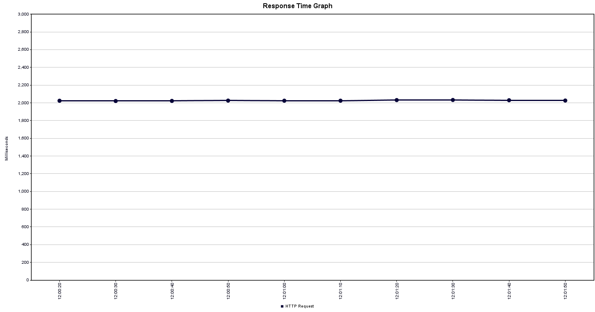
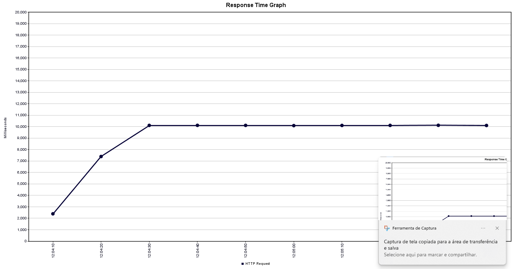

## Threads Virtuais vs Threads de Plataforma no Spring Boot com Java 21

### Sumário

1. [Introdução](#introdução)
2. [Configuração do ambiente](#configuração-do-ambiente)
    - [Hardware](#hardware)
    - [Software](#software)
    - [Configuração do teste de carga](#configuração-do-teste-de-carga)
3. [Implementação do controller](#implementação-do-controller)
4. [Resultados](#resultados)
5. [Análise dos resultados](#análise-dos-resultados)
6. [Conclusão](#conclusão)
7. [Considerações finais e ressalvas](#considerações-finais-e-ressalvas)
8. [Recomendação](#recomendação)
9. [Fontes](#fontes)

---

### Introdução

Este relatório apresenta os resultados de um benchmark realizado para comparar o desempenho de **threads virtuais**, introduzidas no **Java 21** via **Project Loom**, com **threads de plataforma** (tradicionais) em uma aplicação **Spring Boot**. O objetivo é avaliar a escalabilidade e a eficiência em cenários de alta concorrência, utilizando a ferramenta de teste de carga **Apache JMeter**.

---

### Configuração do Ambiente

#### Hardware
- **Processador:** 11th Gen Intel(R) Core(TM) i7-11800H @ 2.30GHz (8 núcleos físicos, 16 threads)
- **Memória RAM:** 16 GB (utilizável: 15,8 GB)
- **Armazenamento:** SSD NVMe 512 GB
- **Sistema Operacional:** Windows 10 64 bits

#### Software
- **Versão do Java:** OpenJDK 21, com suporte a **Project Loom** para habilitar threads virtuais.
- **Versão do Spring Boot:** 3.3.4, executado localmente no **IntelliJ IDEA**.
- **Configuração de Threads de Plataforma:** Padrão do Spring Boot, com um pool de threads limitado pelo sistema operacional.
- **Configuração de Threads Virtuais:** Ativação de threads virtuais via `application.yaml`:
  ```yaml
  spring.threads.virtual.enabled=true
  ```

#### Configuração do teste de carga
- **Ferramenta utilizada:** Apache JMeter 5.5
- **Simulação:** 1000 usuários simultâneos com tempo de ramp-up de 10 segundos.
- **Duração total do teste:** 100 segundos.
- **Headers:** `Content-Type: application/json`
- **Requisição simulada:** `POST /v1/pessoas`, com um payload JSON de criação de pessoa:
  ```json
  {
    "cpf": "89084980875",
    "nome": "FULANO",
    "enderecos": [
      {
        "cep": "22041012"
      }
    ]
  }
  ```

---

### Implementação do Controller

O controlador da API foi configurado para criar e manipular a entidade `Pessoa`, compatível com o fluxo de testes de carga descrito anteriormente. Abaixo está a implementação do endpoint `/v1/pessoas`, que recebe requisições `POST` para criar uma nova pessoa:

```java
@RestController
@RequestMapping(value = "/v1/pessoas")
@RequiredArgsConstructor
public class PessoaController extends BaseController {

  private final PessoaService pessoaService;
  
  private final PessoaMapper pessoaMapper;

  @ResponseStatus(HttpStatus.CREATED)
  @PostMapping(consumes = MediaType.APPLICATION_JSON_VALUE, produces = MediaType.APPLICATION_JSON_VALUE)
  public PessoaDTO create(@Parameter(description = "Informações da nova pessoa", required = true) @Valid @RequestBody final PessoaVO data) throws AlreadyExistsException, InterruptedException {
    final Pessoa pessoa = pessoaService.create(pessoaMapper.toEntity(data));
    
    return pessoaMapper.toDTO(pessoa);
  }
}
```

---

### Resultados

Os resultados foram obtidos a partir dos testes realizados com *1000 usuários simultâneos* e *duração de 100 segundos*. Abaixo estão os dados coletados, comparando o desempenho entre threads virtuais e threads de plataforma:

| Parâmetro              | Threads Virtuais | Threads de Plataforma |
|------------------------|---------------------------|----------------------------------------------|
| **Número total de requisições**  | 47.336                    | 10.691                                       |
| **Tempo médio de resposta (ms)** | 8,41                      | 1977,03                                      |
| **Desvio padrão (ms)**           | 184,49                    | 38,57                                        |
| **Mediana (ms)**                 | 133,72                    | 27,96                                        |
| **Tempo máximo (ms)**            | 407,0                     | 407,0                                        |
| **Taxa de transferência (req/s)**| 464,16                    | 97,04                                        |

Abaixo estão os gráficos de tempo de resposta obtidos durante os testes com threads virtuais e threads de plataforma:


*Gráfico de Tempo de Resposta com Threads Virtuais*


*Gráfico de Tempo de Resposta com Threads de Plataforma*

---

### Análise dos resultados

1. **Capacidade de Processamento:**
    - Com threads virtuais, a aplicação processou **47.336 requisições** em 100 segundos, enquanto com threads de plataforma, processou apenas **10.691 requisições** no mesmo período. Esse resultado demonstra um aumento de mais de **4,4 vezes** na capacidade de processamento com threads virtuais.

2. **Tempo Médio de Resposta:**
    - O tempo médio de resposta com threads virtuais foi de apenas **8,41 ms**, comparado aos **1977,03 ms** com threads de plataforma. Isso confirma a maior eficiência das threads virtuais em lidar com grandes volumes de requisições simultâneas.

3. **Estabilidade e Desempenho:**
    - O desvio padrão com threads virtuais (**184,49 ms**) foi maior, indicando uma maior variabilidade nas respostas, mas o desempenho médio foi superior, demonstrando maior eficiência sob alta carga.
    - Ambas as configurações mantiveram um tempo máximo de **407 ms**, mas com threads virtuais a aplicação manteve uma taxa de transferência muito superior, processando mais requisições por segundo.

---

### Conclusão

Os resultados deste benchmark mostram claramente que o uso de threads virtuais no **Spring Boot** com **Java 21** oferece uma escalabilidade significativamente maior em comparação com threads de plataforma tradicionais. Com threads virtuais:
- **A capacidade de processamento aumentou mais de 4 vezes**, com a aplicação processando um número muito maior de requisições.
- **O tempo médio de resposta foi reduzido drasticamente**, de quase 2 segundos para menos de 10 milissegundos.

Esses ganhos de desempenho tornam as threads virtuais uma opção recomendada para sistemas que precisam lidar com uma alta quantidade de requisições simultâneas e operações intensivas de I/O.

---

### Considerações finais e ressalvas

Embora o uso de threads virtuais traga benefícios significativos em termos de escalabilidade e desempenho, algumas considerações devem ser feitas antes de adotar essa tecnologia em ambientes de produção:

1. **Compatibilidade com bibliotecas e frameworks:**
    - Verifique se as bibliotecas e frameworks utilizados na aplicação são compatíveis com threads virtuais, especialmente em sistemas legados.

2. **Overhead em tarefas CPU-bound:**
    - As threads virtuais oferecem grandes vantagens em cenários I/O-bound (operações de leitura e escrita), mas para tarefas CPU-bound (processamento intensivo), o ganho de performance pode ser menor. Para essas tarefas, o uso de threads tradicionais pode ser suficiente.

3. **Monitoramento e Debugging:**
    - Ferramentas de monitoramento tradicionais podem não capturar corretamente o comportamento de threads virtuais. Pode ser necessário adaptar o sistema de monitoramento para garantir que todas as threads sejam acompanhadas adequadamente.

---

### Recomendação

Diante dos resultados apresentados, recomenda-se fortemente a adoção de **threads virtuais** em aplicações que necessitam de alta escalabilidade e eficiência, especialmente em sistemas que lidam com muitas requisições simultâneas e operações de I/O. Avaliações cuidadosas devem ser feitas em cenários CPU-bound e com ferramentas de monitoramento para garantir uma transição tranquila e eficiente.

---

## Fontes

1. "Virtual Threads in Spring 6", **Baeldung**. Disponível em: [https://www.baeldung.com/spring-6-virtual-threads](https://www.baeldung.com/spring-6-virtual-threads)
2. "O Fim do Webflux no Spring Boot: Virtual Threads e Java 21", **Medium**. Disponível em: [https://medium.com/@sheywesk/o-fim-do-webflux-no-spring-boot-virtual-threads-java-21-b5a63e20f9ef](https://medium.com/@sheywesk/o-fim-do-webflux-no-spring-boot-virtual-threads-java-21-b5a63e20f9ef)
3. "Implementando Paralelismo com Virtual Threads no Java 21", **Dev.to**. Disponível em: [https://dev.to/cassunde/implementando-paralelismo-com-virtual-threads-no-java-21-3om8](https://dev.to/cassunde/implementando-paralelismo-com-virtual-threads-no-java-21-3om8)
4. "Explorando o Poder das Threads Virtuais no Java 21", **Medium**. Disponível em: [https://medium.com/@coffeeandtips.tech/exploring-the-power-of-virtual-threads-in-java-21-29f83c88367c](https://medium.com/@coffeeandtips.tech/exploring-the-power-of-virtual-threads-in-java-21-29f83c88367c)
5. "Java 21 Virtual Threads: Dude, Where's My Lock?", **Netflix Tech Blog**. Disponível em: [https://netflixtechblog.com/java-21-virtual-threads-dude-wheres-my-lock-3052540e231d](https://netflixtechblog.com/java-21-virtual-threads-dude-wheres-my-lock-3052540e231d)
